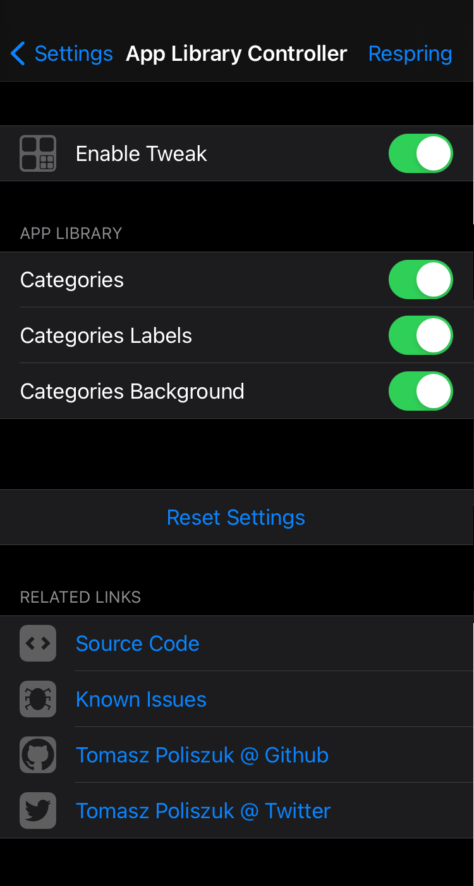
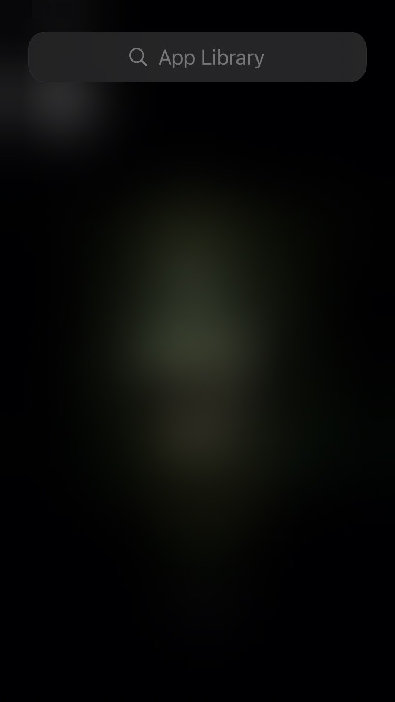
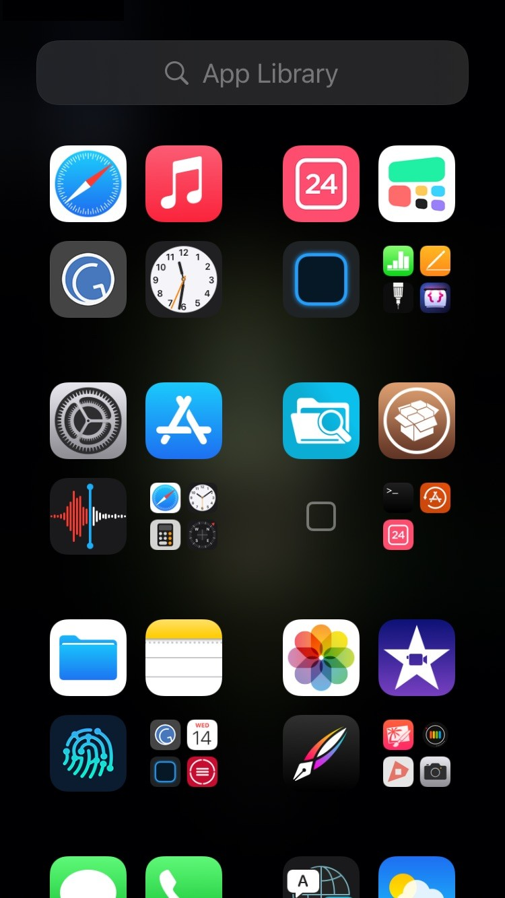
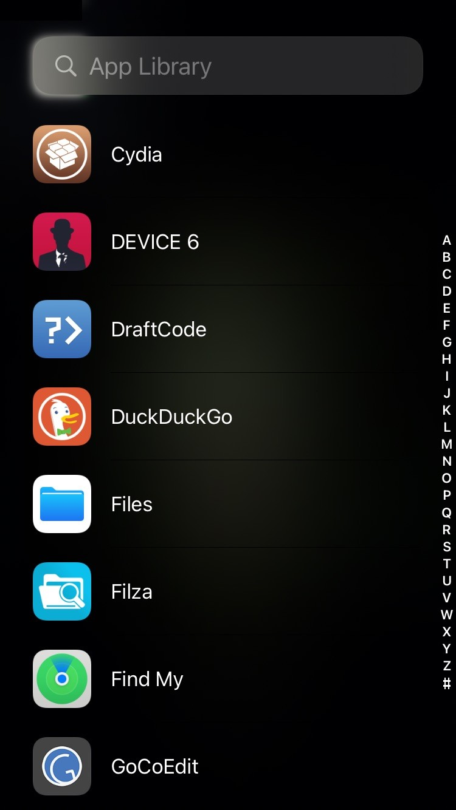

# App Library Controller
Control App Library

## Compatibility
iOS 14 and above

## What you can do with this tweak:
* Choose First View (Categories, Alphabetic List)
* Categories (Show/Hide)
* Labels of Categories (Show/Hide)
* Background of Categories (Show/Hide)

**Configure options from Settings.**

## Screenshots:

